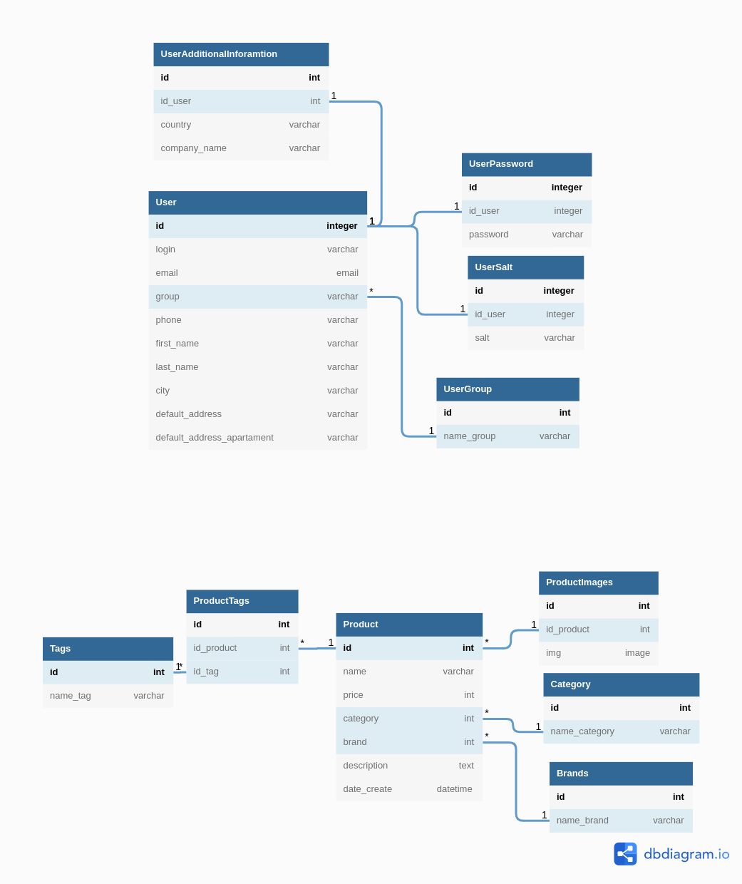

# Структура БД

# Описание таблиц

------------

## 1. User

Таблица описывает модель пользователя

|          Имя поля          |  Тип данных  |                 Описание                 |
|:--------------------------:|:------------:|:----------------------------------------:|
|             id             | primary_key  |                                          |
|           login            | varchar(50)  |            Логин пользователя            |
|           email            |    email     |            Email пользователя            |
|           group            | varchar(100) | Группа, к которой отностися пользователь |
|           phone            | varchar(12)  |       Номер телефона пользователя        |
|         first_name         | varchar(50)  |        Настоящее имя пользователя        |
|         last_name          | varchar(50)  |           Фамилия пользователя           |
|            city            | varchar(100) |           Гоород пользователя            |
|      default_address       | varchar(150) |       Адрес доставки по умолчанию        |
| default_address_apartament | varchar(50)  |    Вторая часть доставки по умолчанию    |

## 2. UserAdditionalInformation

Таблица содержит дополнительную информацию о пользователе 

|   Имя поля   |  Тип данных  |     Описание      |
|:------------:|:------------:|:-----------------:|
|      id      | primary_key  |                   |
|   id_user    |     int      |  ИД пользователя  |
|   country    | varchar(100) |      Страна       |
| company_name | varchar(100) | Название компании |

## 3. UserPassword

Таблица содержит хэши с паролями для пользователей

| Имя поля |  Тип данных  |        Описание         |
|:--------:|:------------:|:-----------------------:|
|    id    | primary_key  |                         |
| id_user  |     int      |     ИД пользователя     |
| password | varchar(256) | Хэш пароля пользователя |

## 4. UserSalt

Таблица содержит соль для пароля соответствующего пользователя

| Имя поля | Тип данных  |         Описание         |
|:--------:|:-----------:|:------------------------:|
|    id    | primary_key |                          |
| id_user  |     int     |     ИД пользователя      |
|   salt   | varchar(64) | Соль пароля пользователя |

## 5. UserGroup

Таблица содержит существующие группы пользователей

| Имя поля |  Тип данных  |    Описание     |
|:--------:|:------------:|:---------------:|
|    id    | primary_key  |                 |
|  group   | varchar(100) | Название группы |

## 6. Product

Таблица, описывающая товар

|  Имя поля   |  Тип данных  |        Описание        |
|:-----------:|:------------:|:----------------------:|
|     id      | primary_key  |                        |
|    name     | varchar(150) |    Название товара     |
|    price    |     int      |          Цена          |
|  category   |     int      |    Категория товара    |
|    brand    |     int      |         Брэнд          |
| description |     text     |    Описание товара     |
| date_create |   datetime   | Дата добавления товара |

## 7. ProductImages

Таблица содержит рисунки для продукта

|  Имя поля  | Тип данных  |   Описание    |
|:----------:|:-----------:|:-------------:|
|     id     | primary_key |               |
| id_product |     int     |   ИД товара   |
|    img     |    image    | Сама картинка |

## 8. Category

Таблица с категориями

|   Имя поля    |  Тип данных  |      Описание      |
|:-------------:|:------------:|:------------------:|
|      id       | primary_key  |                    |
| name_category | varchar(100) | Название категории |

## 9. Brands

Таблица с брендами

|  Имя поля  |  Тип данных  |    Описание     |
|:----------:|:------------:|:---------------:|
|     id     | primary_key  |                 |
| name_brand | varchar(100) | Название бренда |

## 10. Tags

Таблица с тегами

| Имя поля |  Тип данных  |   Описание    |
|:--------:|:------------:|:-------------:|
|    id    | primary_key  |               |
| name_tag | varchar(100) | Название тэга |

## 11. ProductTags

Таблица для связи ManyToMany между тегами (`Tags`) и товарами (`Product`)

|  Имя поля  | Тип данных  | Описание  |
|:----------:|:-----------:|:---------:|
|     id     | primary_key |           |
| id_product |     int     | ИД товара |
|   id_tag   |     int     |  ИД тэга  |

